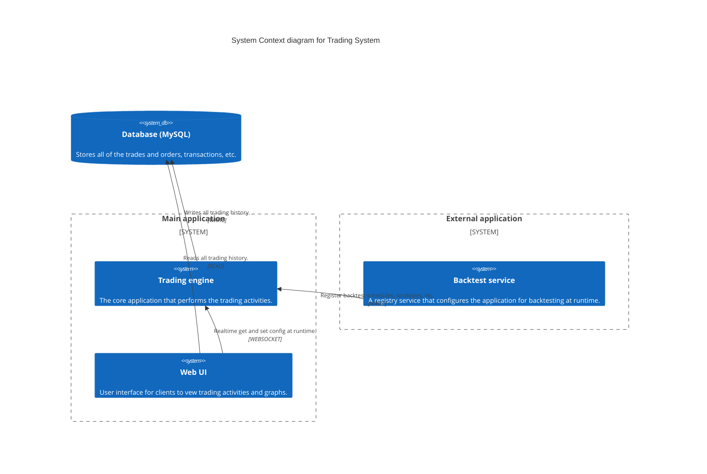

# MCT Trading Bot

[](https://github.com/toniton/ml-crypto-trading/actions/workflows/ci.yml)
[](https://github.com/pylint-dev/pylint)
[](https://codecov.io/github/toniton/ml-crypto-trading)
[](https://github.com/pre-commit/pre-commit)
[](https://hub.docker.com/r/toniton/ml-crypto-trading)

MCT (stands for ML-Crypto-Trading) trading bot is a free and open-source cryptocurrency trading engine written in
Python.
> Caveat Utilitor! For educational and research purposes only.
## Usage

### Configuration

Create an asset configuration file and environment file with your API credentials.

**assets.yaml**
```yaml
assets:  
  - name: "Bitcoin (Crypto.com)"
    base_ticker_symbol: "BTC"
    quote_ticker_symbol: "USD"
    exchange: "CRYPTO_DOT_COM"
    min_quantity: 0.00001
    decimal_places: 8
    candles_timeframe: "MIN1"
    schedule: 4
    guard_config:
      max_drawdown_period: 800
      max_drawdown_percentage: 0.10
      cooldown_timeout: 0
```

Running the bot usually requires some environment variables, it is therefore recommended to pass them inline using 
docker environment arguments or create a .env file such as below:

**.env**
```
APP_ENV=production
CRYPTO_DOT_COM__API_KEY=your_api_key
CRYPTO_DOT_COM__SECRET_KEY=your_secret_key
POSTGRES_PASSWORD=your_password
POSTGRES_DATABASE=trading_bot
POSTGRES_USER=postgres
DATABASE_CONNECTION_HOST=localhost:5432
```

See `examples/configurations/` for more examples.

### Live Trading

**Option 1: Docker (Recommended)**

```bash
docker pull toniton/ml-crypto-trading
docker run --env-file .env toniton/ml-crypto-trading --assets-conf=examples/configurations/assets.yaml
```
Or with a one-liner:

```shell
    docker run -v $PWD:/workspace \
  -e APP_ENV='production' \
  -e DATABASE_CONNECTION_HOST='localhost:5432' \
  toniton/ml-crypto-trading:latest \
  --assets-conf=examples/configurations/assets.yaml 
```

Or with Docker Compose:
```bash
docker compose up -d trading_bot
```

**Option 2: Local Setup**

```bash
python main.py --assets-conf=examples/configurations/assets.yaml
```

Requirements:
- PostgreSQL database running
- Environment variables configured in `.env`
- Python 3.12+

See `Makefile` for additional commands.

### Backtesting

Test your strategy with historical data:

```bash
python main.py --assets-conf=examples/configurations/backtest-assets.yaml --backtest-mode=true --backtest-source=examples/coinmarketcap/history
```

Download historical data from [CoinMarketCap](https://coinmarketcap.com/). The CSV format is supported out of the box.
## Motivation

The intent of developing yet-another-trading-bot is to create a simple trading bot that combines engineering
expertise with financial skills within a clean, modular architecture. To enhance easy collaboration — allowing
developers and traders to integrate, experiment, and extend trading strategies with minimal complexity.

## Core Features (Currently Supported)

### Multi-Asset Support

Trade and manage multiple assets seamlessly across supported exchanges.

### Consensus Strategy

Multi-strategy decision engine powered by a Byzantine Fault Tolerant (BFT) voting mechanism.

### Intelligent Trading Scheduler

Trading scheduler gives you control over the frequency each asset trades: every second to every minute, hour, or day.

### Audit Log Replay

Audit logs can be replayed through the backtesting system.

### Trading mode

- Spot trading

### Supported Exchanges

- [Crypto.com Exchange](https://crypto.com/exchange)

### Simulated Trading

You can run the bot in simulated mode, where order placement is intercepted and executed in-memory without hitting the
real exchange.

```bash
python main.py --assets-conf=examples/configurations/assets.yaml --simulated=true
```

## Core concepts

### Trading context

The trading context contains market data and other information required necessary for strategies to make informed
trading decisions regarding buy and sell actions.

It tracks essential elements such as:

- Balances: Starting, available, and closing balances.
- Trade Metrics: Buy and sell counts, price ranges, and open/closed positions.
- Timestamps: Start time, end time, and last activity time for monitoring trading sessions.

### Consensus

The consensus model is built into the trading engine, enabling multiple strategies to make trade decisions cooperatively
rather than competitively. This setup allows strategies to form a quorum and collectively vote using
the [Byzantine Fault Tolerance](https://en.wikipedia.org/wiki/Byzantine_fault) approach.

### Strategies

Strategies are rules that define the decision-making of a trade action based on the trading context,
technical indicators, candle data and other pre-configured settings. Each strategy can operate independently or as part
of a multi-strategy consensus group.

### Prediction (WIP)

The trading engine can leverage machine learning models (AI/ML), such
as [Random forest classifier](https://en.wikipedia.org/wiki/Random_forest) to predict price direction (uptrend or
downtrend). Predictions are integrated into the trading workflow via a Prediction Strategy, which is invoked dynamically
by the trading engine

> See Link - https://github.com/toniton/ml-assets-prediction

### Storage

Orders are stored in MySQL database for persistence/retrieval. However, temporary data are stored within the application
context and are lost when the application is stopped.

### Backtesting

The application allows a backtesting service to be register providers and strategies at runtime.
It supports **multi-asset** simulation where each asset runs on an independent, concurrent clock. This allows for
realistic simulation of multiple markets simultaneously.

## Architecture



## Logging Architecture

The trading bot uses a mixin-based logging architecture that separates concerns and supports auditability.

### Configuration

Logging is configured via `EnvironmentConfig` (Pydantic) using the following environment variables:

- `LOG_DIR`: Directory for log files. Defaults to the current directory (`.`).
- `LOG_LEVEL`: Minimum logging level (e.g., `DEBUG`, `INFO`). 
    - **Default Behavior**: 
        - `DEBUG` when `APP_ENV` is `staging`.
        - `INFO` when `APP_ENV` is `production` or other environments.

### Log Types

- **Application Logs** (`application-YYYY-MM.log`): Debugging and operational logs including:
  - Application startup/shutdown
  - Configuration loading
  - Consensus calculations
  - Market data fetching
  - Balance checks
  - Errors and exceptions with stack traces
  - Websocket connections
  - Database operations
  
- **Trading Logs** (`trading-YYYY-MM.log`): **Order events only**:
  - Order opened events (BUY orders)
  - Order closed events (SELL orders)
  
- **Audit Logs** (`audit-ASSET-YYYY-MM.log`): **Partitioned by asset**, CSV format with market data snapshots captured **only when orders are opened/closed**:
  - Full market data at order execution (close_price, high_price, low_price, volume)
  - Event types: `order_opened`, `order_closed`
  - Enables replay through backtesting

### Log Format

All logs use consistent formatting:
```
2026-01-03 00:43:15,123 - application.c93a7fae.ClassName - INFO - Message content
```

Audit logs use CSV format compatible with the backtest data loader:
```csv
timestamp,asset,event_type,action,close_price,high_price,low_price,volume,context
1735862595789,BTC/USD,order_opened,BUY,42500.50,42600.00,42400.00,1250000,order_id=abc123
1735862655789,BTC/USD,order_closed,SELL,42600.00,42700.00,42500.00,1300000,order_id=abc123
```

### Usage

Classes inherit from logging mixins:

```python
from src.core.logging.application_logging_mixin import ApplicationLoggingMixin
from src.core.logging.trading_logging_mixin import TradingLoggingMixin
from src.core.logging.audit_logging_mixin import AuditLoggingMixin

class MyManager(ApplicationLoggingMixin):
    def some_operation(self):
        self.app_logger.debug("Calculating consensus")
        self.app_logger.info("Configuration loaded")
        self.app_logger.error("Connection failed", exc_info=True)

class TradingComponent(ApplicationLoggingMixin, TradingLoggingMixin, AuditLoggingMixin):
    def execute_trade(self, asset, market_data, order):
        self.app_logger.debug(f"Fetching market data for {asset}")
        
        self.trading_logger.info(f"Order opened: {asset} BUY @ {market_data.close_price}")
        
        correlation_id = self.log_audit_event(
            event_type='order_opened',
            asset=asset,
            action='BUY',
            market_data=market_data,
            context=f'order_id={order.uuid}'
        )
```

### Audit Log Replay

Audit logs can be replayed through the backtesting system:
```bash
python main.py --assets-conf=config.yaml --backtest-mode=true --backtest-source=./audit.log
```

This enables analysis of trading decisions with the exact market conditions that existed at the time.

## Related Projects

While this project remains focused on simplicity, learning, and experimentation, we however recommend other projects
conceptually inspired by similar engineering and architectural ideas.

If you're interested in exploring a more advanced and production-grade trading framework, check out:

- [Nautilus Trader](https://github.com/nautechsystems/nautilus_trader) — a high-performance, event-driven algorithmic
  trading platform for professional and research use.

## Contributing 🤝

We welcome contributions from the community!  
If you have an idea for an enhancement or a bug fix, feel free to open a Pull Request.

> **Note:**  
> For larger changes, new features, or proposals (RFCs), please start
> by [opening an issue on GitHub](https://github.com/toniton/ml-stocks-trading/issues/new) — especially for new or
> breaking changes.  
> This helps ensure contributions align with the project’s goals and prevents duplicate work.

### Creating a pull request

1. [Fork](https://github.com/toniton/ml-stocks-trading/fork) the repository.
2. Create a branch for your feature or fix:
    ```bash
      git checkout -b feat/your-feature-name
    ```
3. Make your changes, write tests if applicable, and ensure the code passes linting and CI checks.

4. Submit a [Pull Request (PR)](https://github.com/toniton/ml-stocks-trading/compare) with a clear explanation of your
   changes.

## License

This source code is available on GitHub under
the [GNU Lesser General Public License v3.0](https://www.gnu.org/licenses/lgpl-3.0.en.html).
