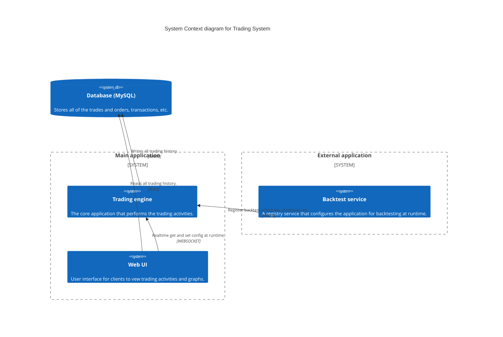

# Architecture

## System Context

## Configuration & System Properties

For a detailed breakdown of system properties, CLI arguments, environment variables, and asset configuration, see
the [Configuration Documentation](configuration.md).

---

## Logging Architecture

The trading bot uses a mixin-based logging architecture that separates concerns and supports auditability. For a
detailed breakdown of log types, configuration, and audit replay, see the [Logging Documentation](logging.md).
